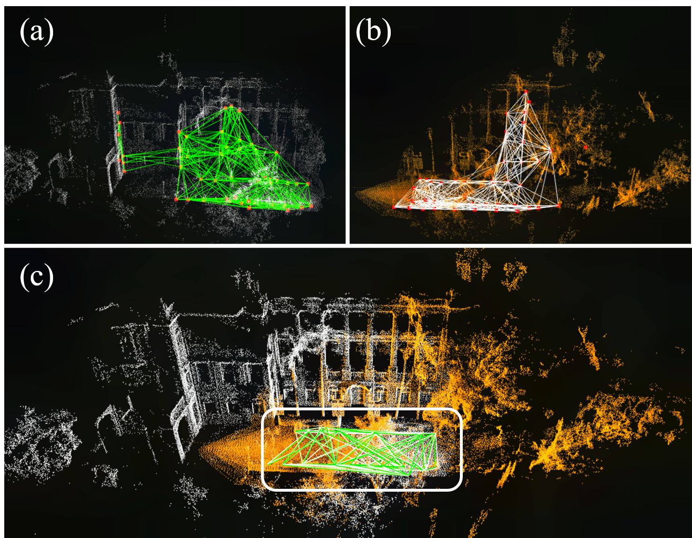
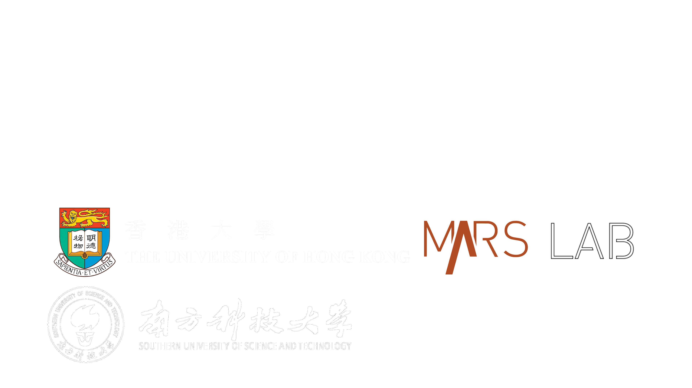

# STD
## A Stable Triangle Descriptor for 3D place recognition
## Introduction
**STD** is a global descriptor for 3D place recognition. For a triangle, its shape is uniquely determined by the length of the sides or included angles. Moreover, the shape of triangles is completely invariant to rigid transformations. Based on this property, we first design an algorithm to efficiently extract local key points from the 3D point cloud and encode these key points into triangular descriptors. Then, place recognition is achieved by matching the side lengths (and some other information) of the descriptors between point clouds. The point correspondence obtained from the descriptor matching pair can be further used in geometric verification, which greatly improves the accuracy of place recognition.

    

        
    

    A typical place recognition case with STD. These two frames of point clouds are collected by a small FOV LiDAR (Livox Avia) moving in opposite directions, resulting in a low point cloud overlap and drastic viewpoint change.

  

### Developers:
[Chongjian Yuan 袁崇健](https://github.com/ChongjianYUAN)， [Jiarong Lin 林家荣](https://github.com/ziv-lin)

### Related paper
Related paper available on **arxiv**:  
[STD: Stable Triangle Descriptor for 3D place recognition](https://arxiv.org/abs/2209.12435)

### Related video
Our accompanying video is now available on **YouTube**.

    

## Codes & Datasets
Our paper is currently under review, and our code will be released once the paper is accepted.